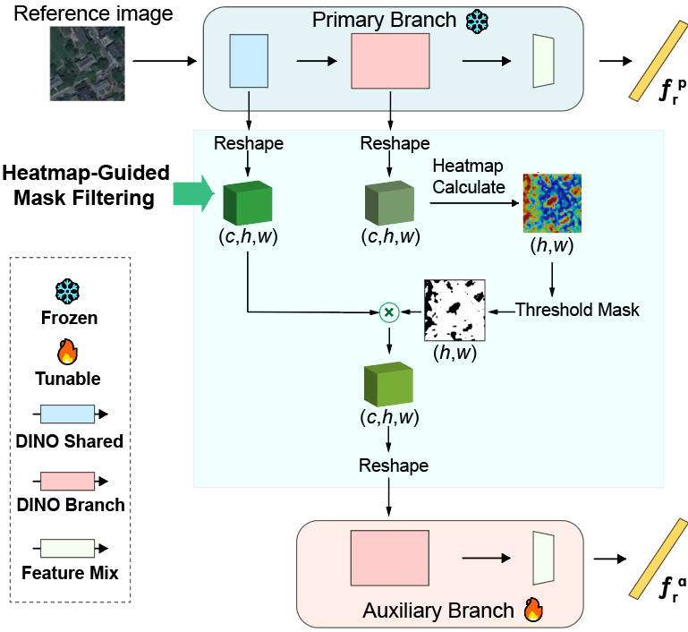
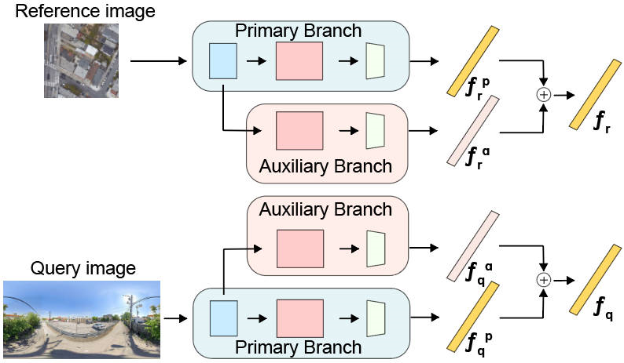

# FREL：面向跨视角地理定位的聚焦区域排除学习

论文已被 **IEEE Journal of Selected Topics in Applied Earth Observations and Remote Sensing** 接收。正式论文链接和引用格式将在出版后更新。

## 方法概览

FREL 面向 **跨视角地理定位** 任务，适用于地面图像、无人机图像与卫星图像之间的跨视角检索。方法采用两阶段训练：第一阶段训练主分支，第二阶段冻结主分支，并利用热力图引导辅助分支学习主分支未充分关注的互补区域。推理时，主分支与辅助分支的描述子通过逐元素相加融合。

<p align="center">
  
</p>

<p align="center">
  
</p>

## 主要特点

- 两阶段主分支/辅助分支训练框架。
- 使用热力图引导的掩码过滤模块挖掘互补区域。
- 通过逐元素相加融合特征，不增加最终描述子维度。
- 在 CVUSA、CVACT、VIGOR 和 University-1652 上进行实验。

## 仓库结构

| 路径 | 说明 |
| --- | --- |
| `file.md` | 文件级项目说明 |
| `CVCities-main/` | 主要代码目录 |
| `CVCities-main/cvcities_base/` | 模型、数据集、损失函数、变换、骨干网络、聚合器和评测工具 |
| `CVCities-main/evaluate/` | 各数据集评测脚本 |
| `CVCities-main/calc_distance/` | GPS 近邻字典预计算脚本 |
| `CVCities-main/train_*.py` | FREL 二阶段训练主脚本 |
| `CVCities-main/train/` | 一阶段/参考训练脚本 |
| `CVCities-main/Vigor_visualisation.py` | 热力图可视化脚本 |
| `CVCities-main/Qualitative Results.py` | Top-k 检索结果可视化脚本 |

更详细的文件说明见 [file.md](./file.md)。

## 环境配置

代码通过各脚本内部的 `Configuration` 进行配置。

```bash
conda create -n frel python=3.10
conda activate frel
pip install -r CVCities-main/requirements.txt
```

请根据本机 CUDA 环境匹配 `torch` 和 `torchvision` 版本。

## 运行前配置

训练或评测前，需要在对应脚本中修改数据集路径、权重路径和 GPU 配置。

| 字段 | 含义 | 位置 |
| --- | --- | --- |
| `data_folder` | 数据集根目录 | 训练/评测脚本 |
| `gps_dict_path` | GPS 近邻字典路径 | 训练脚本 |
| `model_path` | 日志和权重输出目录 | 训练脚本 |
| `checkpoint_start_ready` | 二阶段训练所需的一阶段权重 | `CVCities-main/train_*.py` |
| `checkpoint_start` | 断点继续训练或评测权重 | 训练/评测脚本 |
| `gpu_ids` | 脚本内部 GPU 编号 | 训练脚本 |
| `CUDA_VISIBLE_DEVICES` | 进程可见 GPU | 部分脚本文件开头 |

## 数据准备

请先自行准备对应数据集，并在脚本中修改 `data_folder`。

### 数据集脚本

| 数据集 | 二阶段训练脚本 | 评测脚本 | 设置 |
| --- | --- | --- | --- |
| CVUSA | `CVCities-main/train_cvusa.py` | `CVCities-main/evaluate/eval_cvusa.py` | 地面到卫星 |
| CVACT | `CVCities-main/train_cvact.py` | `CVCities-main/evaluate/eval_cvact.py` | 地面到卫星 |
| VIGOR same-area | `CVCities-main/train_vigor_same.py` | `CVCities-main/evaluate/eval_vigor_same.py` | same-area |
| VIGOR cross-area | `CVCities-main/train_vigor_cross.py` | `CVCities-main/evaluate/eval_vigor_cross.py` | cross-area |
| University-1652 S2D | `CVCities-main/train_universitySD.py` | `CVCities-main/evaluate/eval_university.py` | 卫星到无人机 |
| University-1652 D2S | `CVCities-main/train_universityDS.py` | `CVCities-main/evaluate/eval_university.py` | 无人机到卫星 |

### GPS 近邻字典预计算

当训练脚本中 `gps_sample=True` 且 `custom_sampling=True` 时，需要先生成 GPS 近邻字典。

| 数据集 | 预计算脚本 | 输出 |
| --- | --- | --- |
| CVUSA | `CVCities-main/calc_distance/calc_distance_cvusa.py` | `gps_dict.pkl` |
| CVACT | `CVCities-main/calc_distance/calc_distance_cvact.py` | `gps_dict.pkl` |
| VIGOR | `CVCities-main/calc_distance/calc_distance_vigor.py` | `gps_dict_same.pkl`, `gps_dict_cross.pkl` |
| CVCities | `CVCities-main/calc_distance/calc_distance_cvcities.py` | `gps_dict_10_cities.pkl` |

University-1652 不需要 GPS 近邻字典。

## 复现流程

FREL 采用两阶段训练：

1. 训练或下载一阶段主分支权重。
2. 将该权重路径填写到 `checkpoint_start_ready`。
3. 运行二阶段 FREL 训练脚本。
4. 使用评测脚本测试训练好的权重。

示例：

```bash
cd CVCities-main
python train_vigor_same.py
python evaluate/eval_vigor_same.py
```

| 数据集 | 一阶段参考脚本 | 二阶段 FREL 脚本 | 评测脚本 |
| --- | --- | --- | --- |
| CVUSA | `train/train_cvusa.py` | `train_cvusa.py` | `evaluate/eval_cvusa.py` |
| CVACT | `train/train_cvact.py` | `train_cvact.py` | `evaluate/eval_cvact.py` |
| VIGOR same-area | `train/train_vigor_same.py` | `train_vigor_same.py` | `evaluate/eval_vigor_same.py` |
| VIGOR cross-area | `train/train_vigor_cross.py` | `train_vigor_cross.py` | `evaluate/eval_vigor_cross.py` |
| University-1652 S2D | `train/train_universitySD.py` | `train_universitySD.py` | `evaluate/eval_university.py` |
| University-1652 D2S | `train/train_universityDS.py` | `train_universityDS.py` | `evaluate/eval_university.py` |

## 模型权重

预训练权重和复现实验权重会随仓库发布。二阶段脚本需要通过 `checkpoint_start_ready` 加载一阶段权重。

## 可视化

使用 `CVCities-main/Vigor_visualisation.py` 生成分支热力图，使用 `CVCities-main/Qualitative Results.py` 生成 Top-k 检索示例。

## 引用

如果本仓库对你的研究有帮助，请引用：

```text
Shuangjiang Li, Guopu Zhu, Hongli Zhang, Xiangyang Luo, Yicong Zhou, and Ligang Wu.
Focused Region Exclusion Learning for Cross-View Geo-localization.
Accepted by IEEE Journal of Selected Topics in Applied Earth Observations and Remote Sensing.
```

正式引用格式将在论文出版后更新。

## 致谢

本代码基于 **CV-Cities: Advancing Cross-View Geo-Localization in Global Cities** 构建。

- GitHub: https://github.com/GaoShuang98/CVCities

参考引用：

```text
@ARTICLE{huang2024cv,
  author={Huang, Gaoshuang and Zhou, Yang and Zhao, Luying and Gan, Wenjian},
  journal={IEEE Journal of Selected Topics in Applied Earth Observations and Remote Sensing},
  title={CV-Cities: Advancing Cross-View Geo-Localization in Global Cities},
  year={2025},
  volume={18},
  pages={1592-1606},
  note={doi: 10.1109/JSTARS.2024.3502160}
}
```
